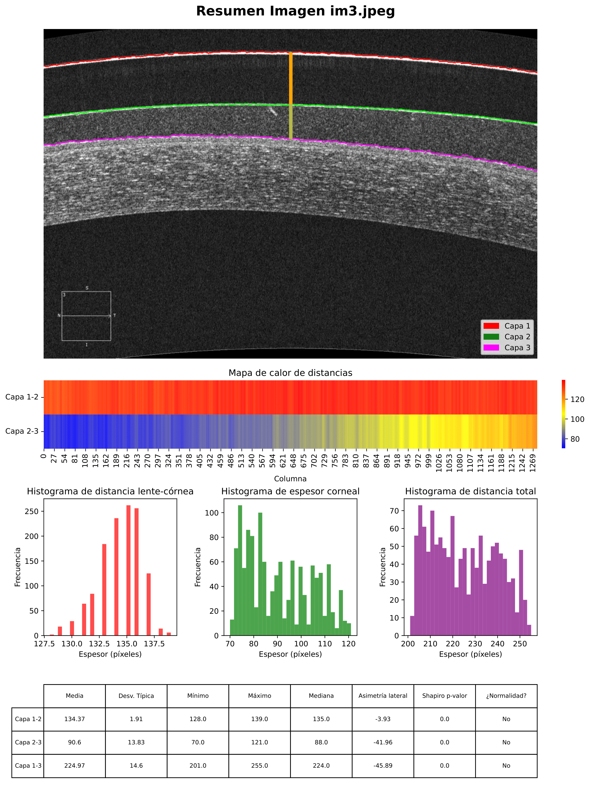

# EyeAutoReport

# CorneaSegmentation

Desarrollé un método automatizado para segmentar capas corneales en imágenes AS-OCT (Tomografía de Coherencia Óptica del Segmento Anterior), con el objetivo de analizar cuantitativamente la relación lente-córnea en pacientes con córnea irregular.

La herramienta permite la obtención rápida de informes gráficos con superposición de capas, gradientes de distancia, histogramas y tablas.

<p align="center">
  
</p>

## Descripción

Este repositorio contiene un pipeline completo para:

1. **Preprocesamiento**: filtrado del ruido y realce de bordes horizontales.
2. **Segmentación**: detección automática de las tres capas más relevantes en la imagen.
3. **Medición**: cálculo columna a columna de las distancias verticales entre capas.
4. **Estadística**: obtención de métricas (media, std, simetría lateral, normalidad...).
5. **Visualización**: creación de informes gráficos con superposición de capas, gradientes de distancia, histogramas y tablas.

## Ejecución

1) De forma interactiva en Jupyter Notebook (`eye_report.ipynb`)

2) De forma automática por terminal 
   El script `auto_eye_report.py` permite procesar todas las imágenes de una carpeta y generar informes automáticamente.
   
```bash
python src/auto_eye_report.py path/a/mis_imagenes/ path/destino/output/
```
## Requisitos

El entorno fue probado con las siguientes versiones:

```txt
matplotlib==3.10.3
numpy==2.2.6
opencv_contrib_python==4.11.0.86
pandas==2.3.0
scipy==1.15.3
seaborn==0.13.2
skimage==0.0
```

Instala las dependencias necesarias ejecutando:
```
pip install -r requirements.txt
```

## Datos

Las imágenes utilizadas en este proyecto provienen del conjunto distribuido por el profesorado a través del Moodle del Máster en Bioinformática para las Ciencias de la Salud (curso 2024/2025).

Por razones de privacidad y derechos, **no se incluyen las imágenes reales en este repositorio público**. Puedes emplear tus propias imágenes AS-OCT (en escala de grises) ubicándolas en un directorio como `Dataset AS-OCT/AS-OCT/`.

> El script y notebook procesan cualquier imagen en formato compatible (JPG, PNG, etc.).
